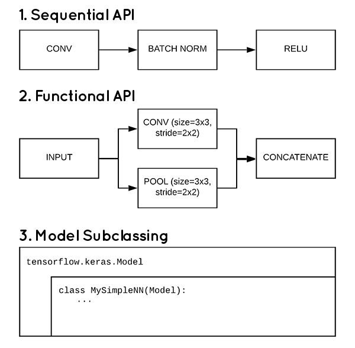

# Giới thiệu về Keras và TensorFlow

`TensorFlow` thì mình đã từng có lần giới thiệu ở [đây](http://tulip4attoo.github.io/dung-tensorflow-giai-quyet-fizzbuzz/). Sau 2 năm, các framework deep learning đã có rất nhiều thay đổi, pytorch đã vươn lên trở thành framework chủ đạo trong giới academic, `tensorflow` thì vẫn giữ vị thế số 1 ở thị trường industry. Các framework cũng dần trở nên trưởng thành hơn, và 1 tương lai khi các framework tương đối tương đồng nhau sắp tới. 

`Keras` từ vị trí 1 python library hỗ trợ cho các framework deep learning, đã trở thành API chính được Google khuyến khích sử dụng trong `TensorFlow` 2.x. Cách viết session ở các bản 1.x cũng không còn nữa, vì vậy, nếu bạn sử dụng `TensorFlow`, bạn nên lập tức upgrade lên bản 2.0 và sử dụng `tf.keras`.

# Về những kiểu viết model bằng Keras

Trong phiên bản TensorFlow 2.0, có 3 cách để tạo ra 1 neural network model:

+ Sequential API
+ Functional API
+ Model subclassing

   
  <i>3 kiểu viết model của Keras trong TensorFlow 2.0</i>

3 kiểu này có những đặc điểm riêng, do đó cũng có những điểm mạnh điểm yếu riêng biệt:

+ Sequential API: cách viết đơn giản, tuy nhiên sẽ không dựng được các shared layer (residual block chẳng hạn), không handle được multiple inputs/outputs, do đó không dựng được 1 số model như Resnet, MVCNN,...

+ Functional API: cách viết có phần tương tự tensorflow graph version 1.x, tuy vậy vẫn có khả năng tạo được các model phức tạp, các layers có khả năng sharing 1 cách đơn giản. Thêm vào đó, tất cả các Sequential model đều có thể tạo được bằng Functional model.

+ Model subclassing: cách viết có phần tương tự pytorch subclassing. Có khả năng viết được các model phức tạp cũng như các khả năng khác của Functional model.

Với cá nhân mình, mình sử dụng cách viết Functional API trong công việc. Đây là cách viết đủ đơn giản, nhưng rất mạnh mẽ, tới giờ các model phức tạp như CRAFT mình đều có thể viết bằng dạng Functional. Chưa kể tới, các pre-model trong Keras cũng được viết theo dạng này, ví dụ như [Inception-Resnet-v2](https://github.com/keras-team/keras-applications/blob/master/keras_applications/inception_resnet_v2.py).

Vậy, ta nên viết model dạng Functional như thế nào?

# Cách viết Keras model dạng Functional

Để minh họa cho việc tạo model dạng Functional, mình sẽ viết lại Resnet 50.

