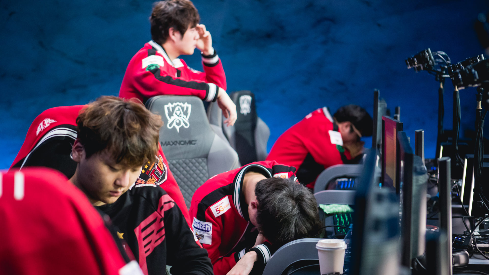
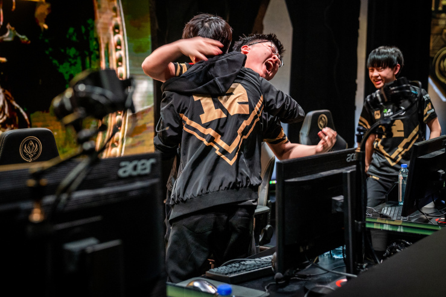
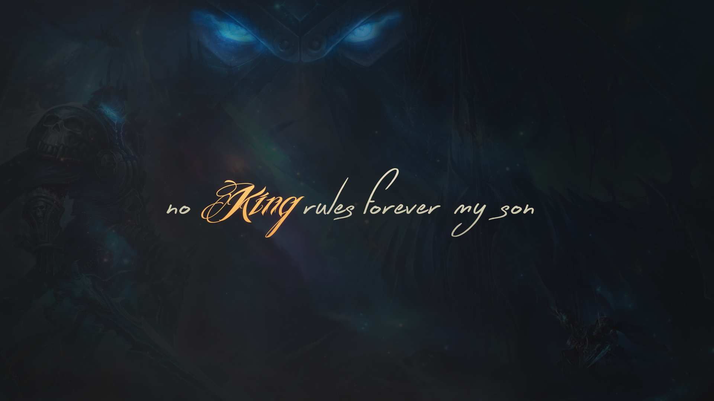

2018 là 1 năm biến động của League of Legends. Cả thế giới thay đổi.

Trung Quốc đang vượt lên mạnh mẽ. Sự vượt lên ấy, cốt lõi tới từ sự đầu tư cực lớn của các đội tuyển. Nhiều đội tuyển LPL đã có nhà thi đấu riêng, ví như sân nhà hơn 1000 chỗ toạ lạc tại Bắc Kinh của RNG. Sự đầu tư lớn, đam mê của người Trung Quốc là nguyên nhân chính thúc đẩy sự phát triển vượt bậc của họ (cùng nhiều nguyên nhân khác, có thể sau này tôi sẽ viết thêm về điều này). 3 chức vô địch thuyết phục của họ trước người Hàn tại MSI, RR và ASIAD là lời khẳng định hùng hồn cho vị thế đang lên của người Trung Quốc. Nếu chiến thắng tại Chung kết thế giới, không nghi ngờ gì nữa, ngôi bá chủ của Liên minh huyền thoại sẽ phải trao cho họ.



  <i>Clip về sân nhà của RNG</i>

Bên kia đại dương, TSM đã không còn là vị vua của Bắc Mỹ nữa. Là đội tuyển duy nhất xuất hiện ở mọi trận chung kết LCS NA, điều đó chẳng còn xảy ra trong năm nay. Con ngoáo ộp TSM tưởng như tiếp tục đà thống trị khi lập nên đội hình All star với việc kết nạp bộ đôi AD – support hàng đầu phương Tây Zven – Mithy, đã không tìm được tiếng nói chung, và liên tục bị loại một cách đáng buồn ở vòng Play-off giải mùa xuân và mùa hè. Ở châu Âu, G2 đã không còn là kẻ thống trị. Sau 2 năm trời là độc cô cầu bại ở EU, cuối cùng G2 đã đánh mất chức vô địch vào mùa xuân, và thậm chí là bị loại ở tứ kết mùa hè này. Mọi thứ đã thay đổi quá nhiều, những đại gia của ngày xưa đã không còn giữ được vị thế của mình nữa.

Còn ở Hàn Quốc, nơi vẫn được mặc định là nơi có nền Liên minh huyền thoại hàng đầu thế giới, mọi thứ cũng vô cùng hỗn loạn. Lần đầu tiên, Faker bị mất suất thi đấu chính thức vào tay một tuyển thủ không mấy tên tuổi, để rồi cuối cùng SKT lần đầu không vào được Play-off. Mùa giải hè LCK 2018, có tới 4 đội tuyển cùng điểm số, và những trận bán kết, chúng kết đều kéo tới ván đấu thứ 5. Chưa bao giờ Hàn Quốc lại đồng đều như hiện nay. Nhưng đồng đều không có nghĩa là mạnh mẽ. Sau 3 thất bại liên tiếp, người Hàn đang run sợ. Sự sợ hãi của người Hàn đã lên tới mức, họ đã cấm rất nhiều tài khoản của các game thủ chuyên nghiệp Trung Quốc tại máy chủ Hàn Quốc, nơi mà các cao thủ thế giới thường xuyên luyện tập, ngay sau khi đại bại trước người Trung Quốc tại ASIAD vừa rồi.

   
  <i>Sự đi xuống của Faker và SKT, phải chăng dự báo 1 tương lai đi xuống của nền Liên minh huyền thoại Hàn Quốc?</i>

Và những lời nguyền, chẳng còn lời nguyền nào cả. Bắt đầu từ All star 2017, Uzi đã chiến thắng toàn bộ các giải đấu mà anh tham gia, huỷ diệt các đối thủ và giành lấy danh hiệu MVP. Hay như Score, anh vừa có 1 trận đấu nghẹt thở, để lần đầu tiên vô địch 1 giải đấu có ý nghĩa. Những vị vua đã không còn thống trị, và những lời nguyền cũng không còn hiệu nghiệm. Điều điên rồ nào sẽ hé lộ trong tháng 10, khi mà Chung kết thế giới khởi tranh?

   
  <i>Uzi trên con đường chinh phục thế giới</i>

Đầu năm nay, tôi đã cho rằng năm tới, 2019 sẽ là năm mà người Trung Quốc vượt lên Hàn Quốc và thống trị thế giới. Nhưng rất có thể, ngay từ năm nay, Hàn Quốc sẽ ngã ngựa, đánh mất vị thế bá chủ ngay trên chính sân nhà mình. Nếu xảy ra, đây sẽ là cái kết tuyệt vời cho 1 năm điên rồ này.

Bởi lẽ, về sau cuối, chẳng vị vua nào có thể trị vì mãi mãi.

   
  <i>At long last, no king rules forever, my son.</i>

