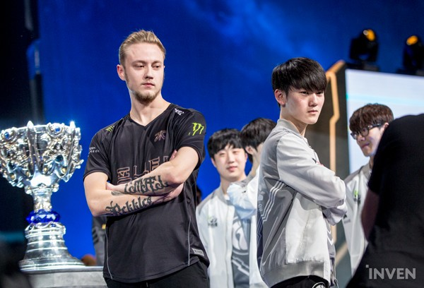

<blockquote><i>
Hư không của sự hư không, hư không của sự hư không, thảy đều hư không.

Các việc lao khổ loài người làm ra dưới mặt trời, thì được ích lợi chi?

Ðời nầy qua, đời khác đến; nhưng đất cứ còn luôn luôn.

Mặt trời mọc, mặt trời lặn, nó lật đật trở về nơi nó mọc.

Gió thổi về hướng nam, kế xây qua hướng bắc; nó xây đi vần lại không ngừng, rồi trở về vòng cũ nó.

Mọi sông đều đổ vào biển, song không hề làm đầy biển; nơi mà sông thường chảy vào, nó lại chảy về đó nữa.

Muôn vật thảy đều lao khổ, loài người không thế nói ra được; mắt không hề chán ngó, tai chẳng hề nhàm nghe.

Ðiều chi đã có, ấy là điều sẽ có; điều gì đã làm, ấy là điều sẽ làm nữa; chẳng có điều gì mới ở dưới mặt trời.
</i></blockquote>

Hàn Quốc là số 1 trong Esport, đó là chân lý vỡ lòng của những tín đồ StarCraft cũng như LoL. Nói riêng LoL, kể từ mùa 3, màu đầu tiên server LoL Hàn được mở, chưa khi nào ngôi vị ấy thực sự lung lay, chỉ trừ vào lúc “Exodus” đầu màu 5, mà sự lung lay ấy cũng tới từ chính những người Hàn tài giỏi nhất đi sang Trung Quốc. Năm ngoái, những tưởng người Trung Quốc có 1 cơ hội lớn, nhưng họ đã để nó tuột đi 1 cách vô cùng đáng tiếc. Chung kết năm ấy vẫn là của 2 đội Hàn Quốc mà thôi.

Đầu năm nay, tôi đã dự đoán người Trung Quốc sẽ vượt Hàn vào năm tới. Nhưng thật chẳng ngờ, Hàn Quốc đã ngã ngựa ngay trên chính sân nhà mình, thua cả EU lẫn Trung Quốc. Dự đoán đã đúng, thiên đường đã rung chuyển và sụp đổ, nhưng đó là 1 sự đổ sụp chẳng ai ngờ. Về sau cuối, chẳng vị vua nào có thể trị vì mãi mãi.

Sự trỗi dậy của EU, sự ngã ngựa của Hàn, của RNG là bất ngờ cực lớn mà chẳng ai ngờ được trước kỳ CKTG này diễn ra, đặc biệt sau màn trình diễn cực kỳ đáng thất vọng của G2, của C9 ở vòng khởi động. Dù biết rằng những thay đổi của Riot màu này là cực kỳ lớn, dù biết rằng lối chơi kiểm soát nổi tiếng của người Hàn, của RNG đã không còn là tối ưu, thì những sự thật này vẫn đủ sức khiến không 1 ai có thể nghĩ tới.

   
  <i>Một trận chung kết không ai ngờ tới</i>

Nhưng đây cũng là một sự động viên to lớn, cũng là lời nhắc về việc cần liên tục thích nghi, bởi lẽ khi thế giới biến động, chỉ những ai có khả năng thích nghi mạnh mẽ nhất mới có thể trụ lại. Và trong thời đại này, khi mà mọi thứ thay đổi quá nhanh chóng và hỗn loạn, điều này lại càng cần thiết gấp bội.

Dưới ánh mặt trời, nhiều thứ đang đổi thay.

