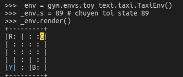
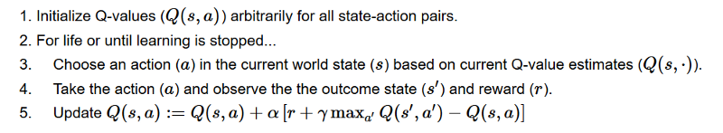
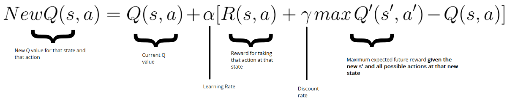

Sau khi cài đặt xong OpenAI gym, chúng ta sẽ tiến hành làm quen thêm với môi trường, biết cách lấy state, reward của môi trường, cũng như cách giải quyết bài toán sử dụng Q-learning. Bài này mang tính giới thiệu và tutorial hướng dẫn các bạn thực hiện code Q-learning. 

## Giới thiệu một số khái niệm của RL

Để hiểu hơn về cách làm trong bài viết này (và những bài viết sau), mình sẽ điểm qua về 1 vài khái niệm của RL:

+ enviroment: môi trường, nơi xảy ra tất cả các hoạt động, sự việc.
+ state: trạng thái hiện tại của môi trường, mang toàn bộ các thông tin.
+ observation: các thông tin mà player có được. Chú ý, observation là tập con, và trong nhiều trường hợp nhỏ hơn state. Tuy nhiên, chúng ta thường không tiếp cận được state, do vậy trong Open AI gym, state mang ý nghĩa là observation. Mình từ đây cũng không gọi là observation mà gọi là state. Tuy nhiên việc này cũng không ảnh hưởng nhiều.
+ policy: hàm để định ra với 1 state, player sẽ thực hiện action nào. Thường ký hiệu là $\pi$
+ value function: hàm xác định value. Có 2 loại chính là xác định value state và xác định value action. Thường ký hiệu là v/V hoặc q/Q.
+ model: thể hiện cách hoạt động của môi trường. Ví dụ sau khi player thực hiện action này thì môi trường sẽ biến đổi như thế nào. Có những môi trường mà ta biết model, nhưng có những môi trường ta không biết (DotA2 chẳng hạn).
+ episodes: hiểu đơn giản là 1 lượt chơi.

Các bạn có thể tìm hiểu thêm những yếu tố cơ bản của RL qua chương 1 + 2 cuốn Reinforcement Learning: An introduction (mà hơi dài hehe).

## Giới thiệu môi trường Taxi-v2

Chúng ta sẽ nói về một environment đơn giản, có số state và số action hữu hạn (và khá nhỏ) là [Taxi-v2](https://gym.openai.com/envs/Taxi-v2/). Trong environment này, agent của chúng ta đóng vai trò 1 tài xế taxi. Có 4 địa điểm cố định khác nhau trên bản đồ (được ký hiệu R, G, Y, B), và mỗi khi environment bắt đầu, sẽ có 2 điểm bất kỳ là điểm đón và trả khách (2 điểm này có thể trùng nhau), cũng như vị trí của taxi cũng là vị trí bất kỳ. Nhiệm vụ của chúng ta là đón hành khách (ở điểm màu xanh da trời) và trả khách (ở điểm màu tím).

Agent của chúng ta có thể thực hiện 6 actions:
+ 0: xuống dưới
+ 1: lên trên
+ 2: sang trái
+ 3: sang phải
+ 4: đón khách
+ 5: trả khách

Reward của environment này được tính như sau:

+ cứ sau 1 time step (tức là khi xảy ra bất kỳ action nào), sẽ nhận -1 reward
+ nhận được +20 reward nếu ta trả khách thành công (nghĩa là time step đó ta sẽ nhận +19 reward)
+ nếu agent có hành vi đón khách và trả khách không hợp lệ, nhận -10 reward (nghĩa là time step đó ta sẽ nhận -11 reward).

Do game chỉ có 500 states cố định, nên các states được mã hóa trong 1 list từ 0 tới 499. Để có thể biết cụ thể 1 state là trạng thái như thế nào, bạn có thể set state rồi render state ra. Vd để tra state 89:

```
import gym

_env = gym.make("Taxi-v2")
_env.s = 89 # set state to 89
_env.render()
```

<p align="center">
  <br>
  <i>Hình ảnh được render ra của state 89</i>
</p>

Bạn có thể đọc kỹ hơn về các thông tin của bài toán bằng cách vọc [source code của môi trường](https://github.com/openai/gym/blob/master/gym/envs/toy_text/taxi.py)


## Về Q learning

Về cơ bản, tư tưởng của Q learning là tính được Value function Q(s,a), từ đó với mỗi một state, ta chỉ cần chọn action a* sao cho Q(s, a*) lớn nhất là được. Vấn đề là làm sao để tính ra Q(s, a)?

Chúng ta chú ý trong bài toán này, số state khá nhỏ (chỉ có 500), vì vậy chúng ta có thể chuyển Q(s,a) từ hàm số ra 1 bảng gọi là q_table, đại loại nó sẽ là bảng tra cứu như thế này:

<p align="center">
  <br>
  <i>Ví dụ về q_table</i>
</p>

Ban đầu, chúng ta sẽ để giá trị mặc định của q_table toàn bộ là 0. Sau đó, ta sẽ cập nhật dần dần các giá trị của q_table theo công thức sau:

<p align="center">
  <br>
  <i>Thuật toán Q learning (sử dụng Bellman equation)</i>
</p>

Đây là công thức tính q_table cho tới khi hội tụ. Chúng ta sẽ phân tích qua bước cuối, cũng là bước quan trọng nhất:

<p align="center">
  <br>
  <i>Cụ thể hơn về cách update q_table (sử dụng Bellman equation)</i>
</p>

+ $Q(s,a) = Q(s,a) + \alpha * X$ là công thức update quen thuộc trong các thuật toán ML.
+ $R(s,a) + \gamma max Q'(s',a')$ sẽ ngày càng hướng tới giá trị thật $G(t)$, điều này dẫn tới việc vế nhân với $\alpha$ sẽ cập nhật giá trị qua các bước, điều chỉnh $Q(s,a)$ tới giá trị hội tụ.

## Giải quyết bài toán

Để giải quyết bài toán, đầu tiên ta thực hiện việc import các packages cần thiết và khởi tạo môi trường

```
import numpy as np
import gym
import time

env = gym.make("Taxi-v2")
```

Sau đó, chúng ta khai báo các biến

```
state_size = env.observation_space.n
action_size = env.action_space.n

q_table = np.zeros((state_size, action_size))

FILE_SAVE = "q_table.npy"
total_episodes = 5000         # Total episodes
total_test_episodes = 100     # Total test episodes
max_steps = 99                # Max steps per episode

learning_rate = 0.7           # Learning rate
discount_rate = 0.95         # Discounting rate

# Exploration parameters
epsilon = 1.0                 # Exploration rate
max_epsilon = 1.0             # Exploration probability at start
min_epsilon = 0.01            # Minimum exploration probability 
decay_rate = 0.01             # Exponential decay rate for exploration prob
```

Ở đây, mình sẽ nói qua về việc lựa chọn 1 số giá trị:

+ total_episodes: bài toán này khá nhỏ nên 5000 là con số đủ lớn để có thể hội tụ được. Nếu bạn train sau đó load mà con số chưa tốt, có thể tăng nó lên.
+ max_steps: thực ra một bài toán, tối ưu chỉ cần đi ~ 10 - 15 bước, có thể lùi con số này về tầm 50 cũng không ảnh hưởng nhiều.
+ discount_rate: con số này bình thường nên set ở ngưỡng 0.95 - 0.99, tuy nhiên thật ra mình train với 0.618 thì vẫn hội tụ ngon lành. Có những bài toán mà chọn model đúng thì parameter chỉ việc xõa.

Ngoài ra, q_table được tạo ra với số hàng tương ứng với số lượng state (500), số cột tương ứng với số action (6). Mỗi giá trị tương ứng với cummulative reward (chúng ta tính toán ra, và chưa hẳn đã chính xác) của 1 action cho 1 state.

Sau đó, ta chỉ việc cập nhật Q table thông qua các episodes

```python
for episode in range(total_episodes):
    state = env.reset()
    done = False
    for step in range(max_steps):
        epsilon = min(min_epsilon, epsilon*decay_rate)
        # check if we exploit or not
        if np.random.rand() < epsilon:
            # exploit
            action = np.argmax(q_table[state])
        else:
            action = np.random.randint(0, action_size)
        # get the reward and the next state
        new_state, reward, done, _ = env.step(action)
        # update the q_table via Bellman equation
        update = reward + discount_rate*q_table[new_state].max() - q_table[state,action]
        q_table[state,action] = q_table[state,action] + learning_rate*update
        state = new_state
        if done:
            break
    if episode % 1e3 == 0:
        print("done episode ", episode)
```

Mình sẽ giải thích qua về flow của code. Đầu tiên, ta chạy một vòng lặp qua tất cả các episodes, trong đó mỗi episode ta lại làm như sau:

+ ta khởi động lại enviroment cho episode mới, thiết lập trạng thái enviroment là vẫn đang hoạt động
+ trong episode này, ta sẽ chạy một vòng lặp qua hết các steps:

    + đầu tiên, ta tính toán giá trị epsilon hiện tại (giá trị này thay đổi theo episode, càng ngày càng nhỏ dần). Giá trị này quyết định xem chúng ta sẽ thực hiện exploit theo action tốt nhất (dựa trên q_table) hay explore bằng cách chọn random action kế tiếp.
    + sau đó, chúng ta thực hiện action theo cách chọn ở trên, ghi nhận state mới, reward và check xem episode hiện tại đã hoàn thành hay chưa?
    + chúng ta update q_table dựa trên Bellman equation
    + nếu episode hiện tại đã hoàn thành, ta dừng vòng lặp anyf và chuyển qua vòng lặp mới.

Khi chạy đủ 5000 episodes (total_episodes), chúng ta sẽ thu được 1 bảng q_table.Tới đây, ta có thể lưu kết quả q_table lại để sau có thể dùng

```python
np.save(FILE_SAVE, q_table)
```

Về cơ bản chúng ta đã train xong model. Để thực hiện việc xem xét model chạy như thế nào, ta có thể chạy đoạn code sau, khá tương tự đoạn code training ở trên:

```python
env.reset()
rewards = []

for episode in range(total_test_episodes):
    state = env.reset()
    step = 0
    done = False
    total_rewards = 0

    for step in range(max_steps):
        # UNCOMMENT IT IF YOU WANT TO SEE OUR AGENT PLAYING
        # env.render()
        # Take the action (index) that have the maximum expected future reward given that state
        action = np.argmax(q_table[state,:])
        
        new_state, reward, done, info = env.step(action)
        env.render()
        total_rewards += reward
        print(total_rewards)
        time.sleep(0.5)
        
        if done:
            rewards.append(total_rewards)
            break
        state = new_state
env.close()
print ("Score over time: " +  str(sum(rewards)/total_test_episodes))
```
<p align="center">
  <br>
  <i>Và đây là kết quả, khá ổn phải không nào? (hãy thông cảm cho chất lượng hình ảnh =)))</i>
</p>


Code của phần này được mình lưu [ở đây]. Các bạn có thể chạy file `core.py` để  tiến hành train và có model để lưu lại, hoặc chạy file `load_and_show.py` để xem kết quả hoạt động của model.

Bài chưa thật đầy dủ, nhưng đã rất dài, nên mình tạm dừng ở đây. Bài này mang tính giới thiệu và tutorial, các bạn muốn tìm hiểu cụ thể hơn hãy đọc sách và paper. Cheer!

## Tham khảo

1, https://neurocats.github.io/2017/08/31/part3-Intro/

2, https://medium.freecodecamp.org/diving-deeper-into-reinforcement-learning-with-q-learning-c18d0db58efe

3, Reinforcement Learning: An introduction