Ra mắt trailer tại E3, The last night là 1 vụ nổ lớn. Gây ấn tượng với đồ họa độc đáo và đầy máu sắc, The last night đã thu hút hàng triệu wishlist trên Steam. Tuy vaayjm việc delay quá lâu khiến cái hype của mọi người dần đi vào quên lãng. Mùa hè 2021, REPLACED tung ra trailer, với phong cách đồ họa có phần tương tự The last night. Đây là kiểu đồ họa mà mình thấy rất đẹp, nên sẽ phân tích 1 chút về đồ họa của 2 game thông qua các trailer.





# Về cách sử dụng màu

The last night có theme cyber punk, sử dụng rất nhiều màu với độ bão hòa cao. Do đó, hình ảnh đôi lúc khiến người xem bị chói và khó chịu.

  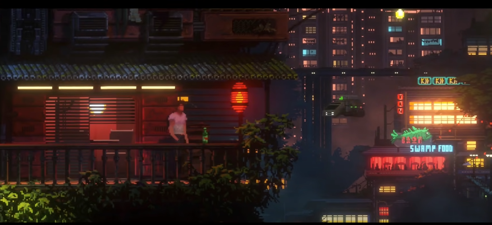 
  <i></i>

Kể cả trong các cảnh dải màu không đa dạng, màu vẫn rất đậm

  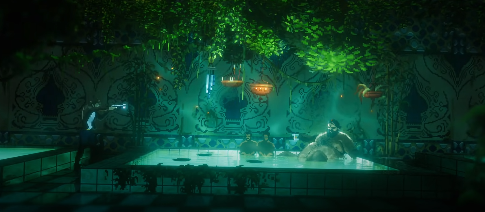 
  <i></i>

  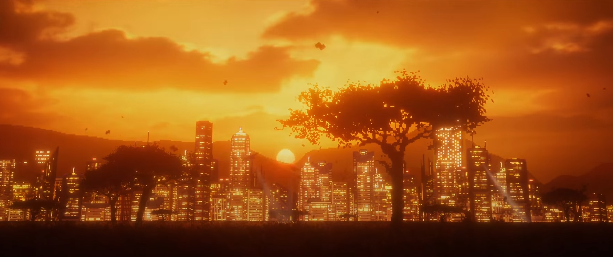 
  <i></i>

REPLACED thì khác, cách dùng màu tốt nhẹ nhàng hơn, ánh sáng không quá chói chang như The last night. Có lẽ điều này là bởi vì bối cảnh nó không phải cyber punk như kia, có vẻ nó là dystopian sci-fi

  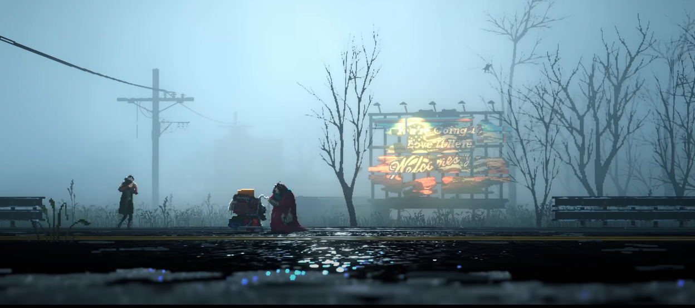 
  <i></i>

  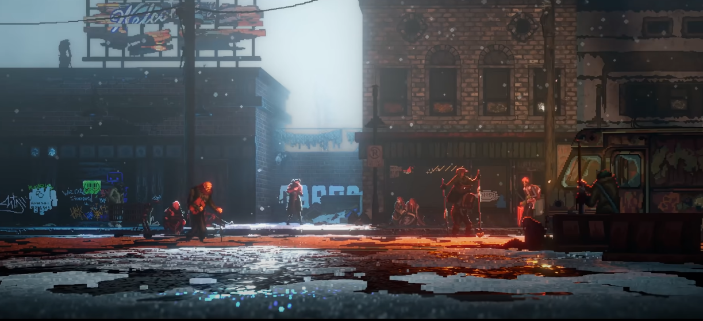 
  <i></i>

# Công nghệ

Thì đều là 2.5D trên nền 3D cả. Đây cũng không phải công nghệ gì lạ lẫm. Có rất nhiều game đã làm chuyện này rất tốt từ xưa, ví như Disney's Hercules

  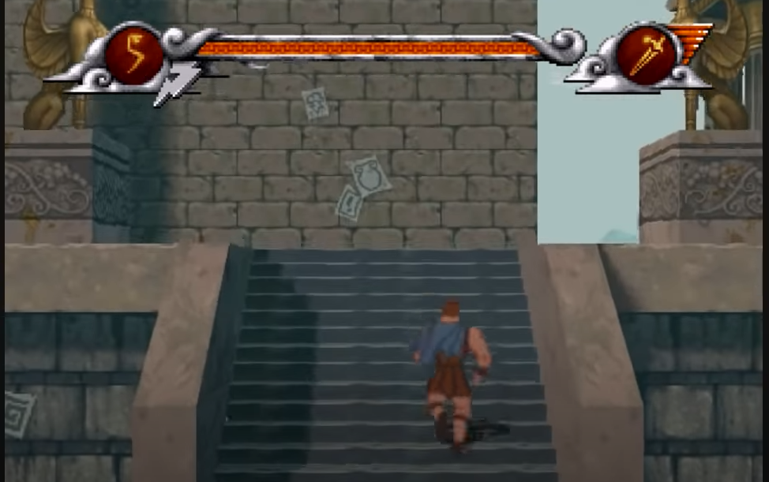 
  <i></i>

Chú ý sự to nhỏ cũng như điểm tụ (dù điểm tụ sai tương đối), thì nó tạo cảm giác 3D rõ rệt (vì thực ra nó chính là 3D). 2 game này cũng thế thôi, chỉ là có nhiều hiệu ứng ánh sáng shader các thứ hơn.

Game engine cả 2 dùng Unity. Có 1 version sinh viên làm tương tự thì cũng dùng Unity. Kết luận là Unity đủ dùng trong trường hợp này. 

Chúng ta cần chú ý là hầu như các chi tiết ở background đều là 3D, chứ không phải 2D.

Cả 2 cái này đều là bối cảnh 3D cả. Texture pixel art thôi, nhân vạt phẳng 2D, chứ bối cảnh thì là 3D. Hiệu ứng rất tốt.

  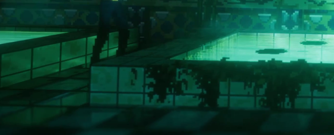 
  <i></i>

  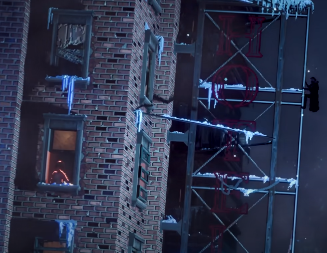 
  <i></i>

# Ánh sáng

Ánh sáng luôn là 1 trong những phần quan trọng trong việc thiết lập môi trường và tạo cảm xúc cho người chơi. Trong cả 2 game, ánh sáng và phản chiếu đều được làm rất kỹ, rất tốt. Ánh sáng được tạo đều là 3d light và sử dụng các hiệu ứng 3d để làm nó thật, đẹp và tạo không khí cho cảnh.

  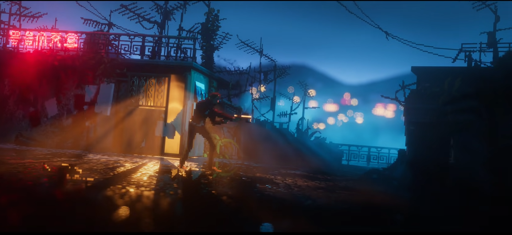 
  <i></i>

  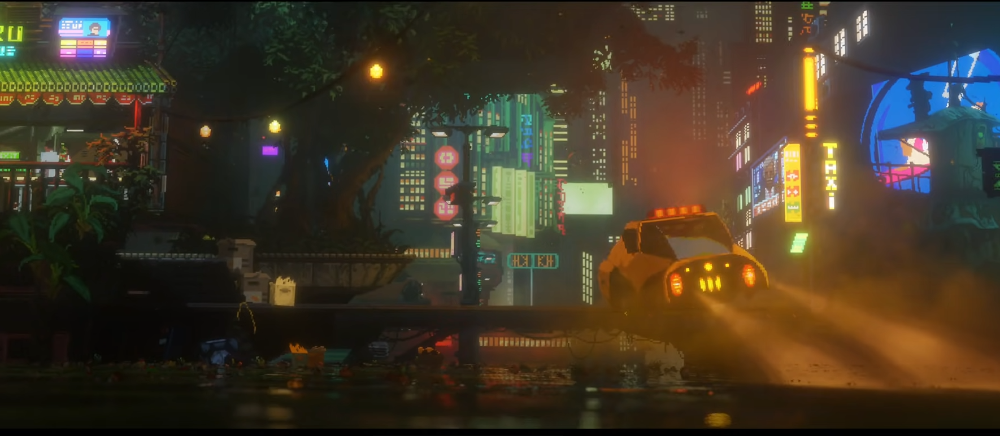 
  <i></i>

Có vẻ 1 phần để phô trương kỹ thuật, trailer của The last night sử dụng tương đối nhiều cảnh nước. Các hiệu ứng được áp dụng cũng rất nhiều.

  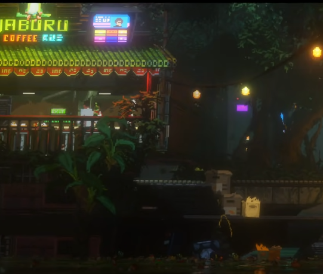 
  <i></i>

  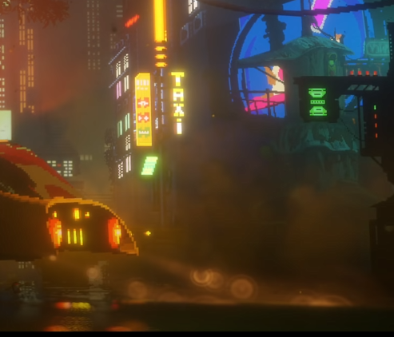 
  <i></i>

Ở REPLACED, hiệu ứng ánh sáng cũng tốt, nhưng phản chiếu qua nước hay vật liệu khác kém hơn nhiều. Chú các các hiệu ứng vẫn tốt, vẫn đủ.

  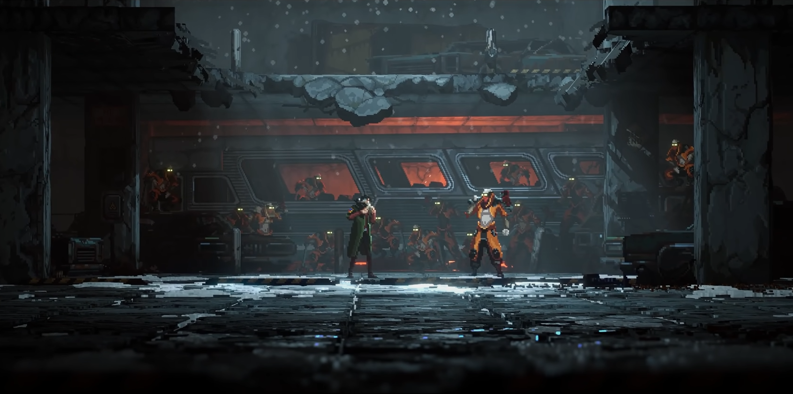 
  <i></i>

# Animation

Phần này thì REPLACED làm tốt hơn rất nhiều. Các animation như là 3d vậy. Có lẽ điều này là nhờ việc render 3d model ra 2d pixel art, mình không hoàn toàn chắc về điều này.

# Render pixel art

  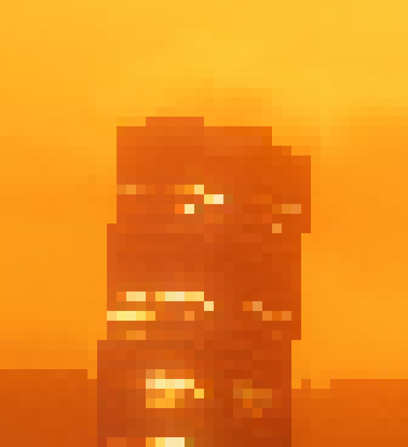 
  <i></i>

  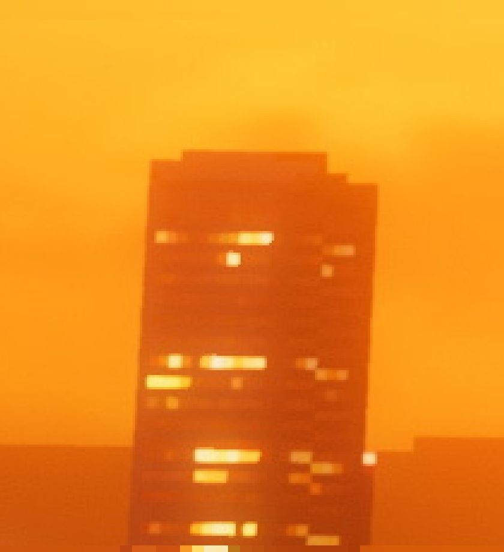 
  <i></i>

Cả 2 game đều không phải là pixel perfect, nó có thể đặt camera nghiêng hoặc xoay nghiêng sprites. Điều này thể hiện rõ trong hình trên. Ngoài ra, cả 2 game đều thực hiện cả các kỹ thuật làm mờ ở các cự ly gần hoặc rất xa. Vì thế, pixel art chỉ là 1 trong các phong cách hình ảnh mà 2 game sử dụng, áp dụng ở texture layer mà thôi.

  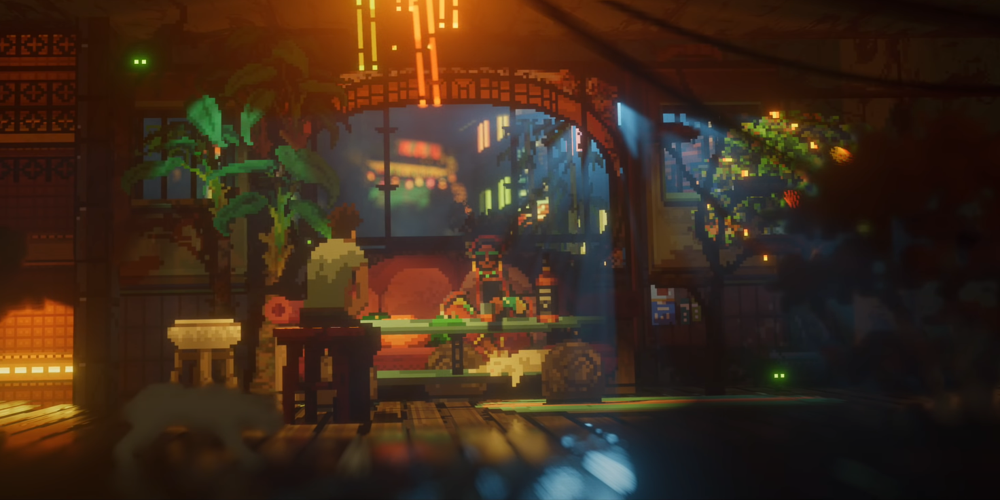 
  <i></i>

Chú ý con mèo bị làm mờ, các hình ảnh phía xa bị làm mờ + hiệu ứng cửa kính.

  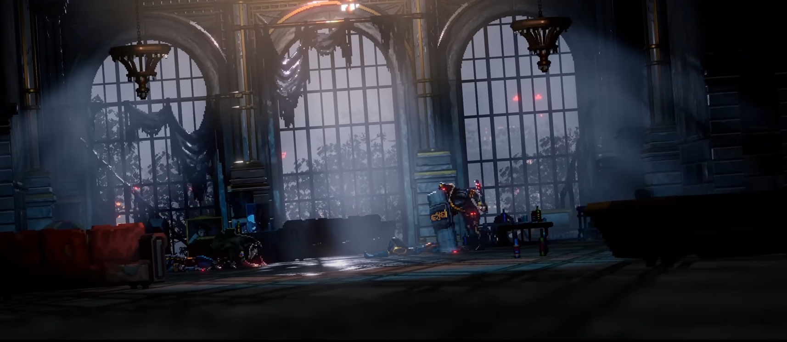 
  <i></i>

REPLACED cũng thực hiện làm mờ cho sàn. Phần background phía ngoài được làm để tạo cảm giác chìm vào background rất tốt.

  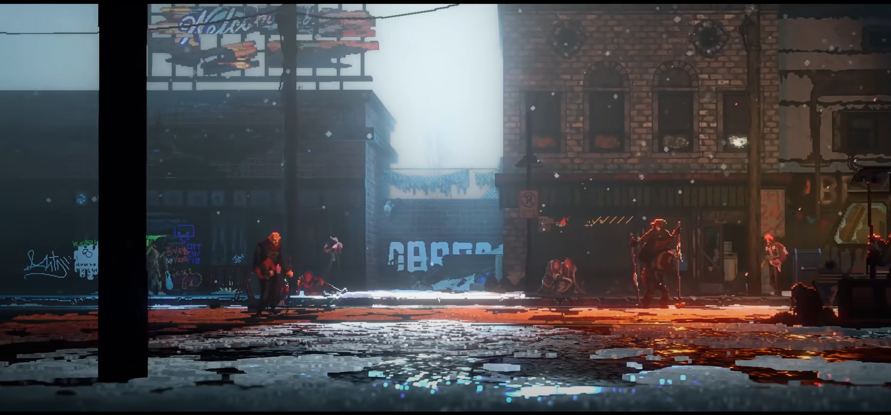 
  <i></i>

Tuy nhiên, vẫn nên làm mờ 1 số phần ở nền, cái này REPLACED chỉ làm mờ phần rất gần màn ảnh, xa 1 tý vẫn rất rõ, tạo cảm giác 3D không quá tốt. Cảm giác như REPLACED tạo 1 khung rồi làm rõ trong khung hơn là dựa vào depth.