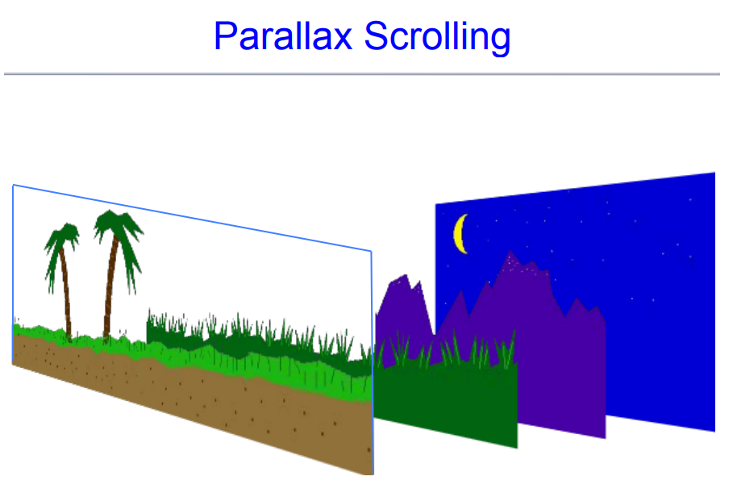

Trong hội họa có 1 khái niệm là phối cảnh. Nó cho ta cảm nhận được vị trí của vật thể trong không gian 3 chiều. Bởi lẽ hầu hết không gian ta muốn thể hiện là không gian 3d, nhưng lại chỉ làm việc trên màn hình 2d. Chúng ta sẽ tìm hiểu về Perspective trong 1 số game 2d.

# Tổng quan về các loại góc nhìn trong game

Đây là map cho các loại camera view trong video game

   
  <i>Các loại camera view cơ bản</i>

Curlinear là 1 loại mang cảm giác kỳ dị, chúng ta biết chứ không đụng vào.

   
  <i>Curlinear</i>

Parallel là dạng khá thích hợp cho 2d game, bởi lẽ khác với perspective, các object sẽ giữ nguyên size khi thay đổi vị trí. Việc thay đổi size khá phức tạp, đặc biệt với pixel art thì việc thay đổi size hầu như là không làm được (0.9x chẳng hạn). Tuy vậy, nếu ta làm trên môi trường 3d thì việc này khá đơn giản. Tất nhiên, việc kết hợp 3d và 2d như thế nào, lại là 1 vấn đề khác.

   
  <i></i>

Dễ dàng nhận thấy trong hình, nếu ta cho 1 nhân vật đi trên con đường thì ta cần resize lại theo nó.

   
  <i></i>

# Parallel perspective

Về cơ bản thì Parallel perspective có 3 loại game perspective chính:

   
  <i>Top-down</i>

   
  <i>Side-on</i>

   
  <i>Isometric</i>

Thông thường, các game 2d hiện nay đều dùng Orthographic Projection. Với cách projection này, vật thể sẽ giữ nguyên size dù cho vị trí của z-axis trong hệ tọa độ là bao nhiêu đi nữa.

   
  <i>Orthographic Projection</i>

   
  <i>With different lens</i>

Vậy, chúng ta sẽ tạo ra cảm nhận 3d cho người chơi như thế nào?

## Bằng composition

   
  <i>Dùng composition để tạo hiệu ứng xa-gần</i>

Chúng ta có thể tạo ra hiệu ứng vật thể này che khuất vật thể kia, như vậy sẽ có cảm giác 3d cho vật này ở trước/sau vật thể kia.

   
  <i>Lập các layer depth khác nhau để có thể che khuất nhau</i>

## Bằng hiệu ứng giảm saturation

   
  <i></i>

   
  <i></i>

Ở gần thì dùng các màu có saturation cao hơn, ở xa thì giảm độ saturation xuống là 1 cách đơn giản và hiệu quả.

## Hiệu ứng Parallax scrolling

   
  <i></i>

Hiệu ứng này kết hợp zoom in/zoom out khá là tốt. Ví dụ như này: 



# Tổng kết

Bài này cũng ngắn và mang mục đích giới thiệu thôi. Sẽ có 1 phân tích cách các game 2d thể hiện đồ họa của họ như thế nào, để học tập. Cheer!

# Tham khảo

[https://docs.unity3d.com/2021.2/Documentation/Manual/Quickstart2DPerspective.html](https://docs.unity3d.com/2021.2/Documentation/Manual/Quickstart2DPerspective.html)

[https://opengameart.org/content/chapter-3-perspectives](https://opengameart.org/content/chapter-3-perspectives)

[https://gamasutra.com/blogs/MichalBerlinger/20160323/268657/Combining_Perspective_and_Orthographic_Camera_for_Parallax_Effect_in_2D_Game.php](https://gamasutra.com/blogs/MichalBerlinger/20160323/268657/Combining_Perspective_and_Orthographic_Camera_for_Parallax_Effect_in_2D_Game.php)

[https://medium.com/retronator-magazine/game-developers-guide-to-graphical-projections-with-video-game-examples-part-2-multiview-8e9ad7d9e32f](https://medium.com/retronator-magazine/game-developers-guide-to-graphical-projections-with-video-game-examples-part-2-multiview-8e9ad7d9e32f)

[https://medium.com/retronator-magazine/game-developers-guide-to-graphical-projections-with-video-game-examples-part-1-introduction-aa3d051c137d](https://medium.com/retronator-magazine/game-developers-guide-to-graphical-projections-with-video-game-examples-part-1-introduction-aa3d051c137d)