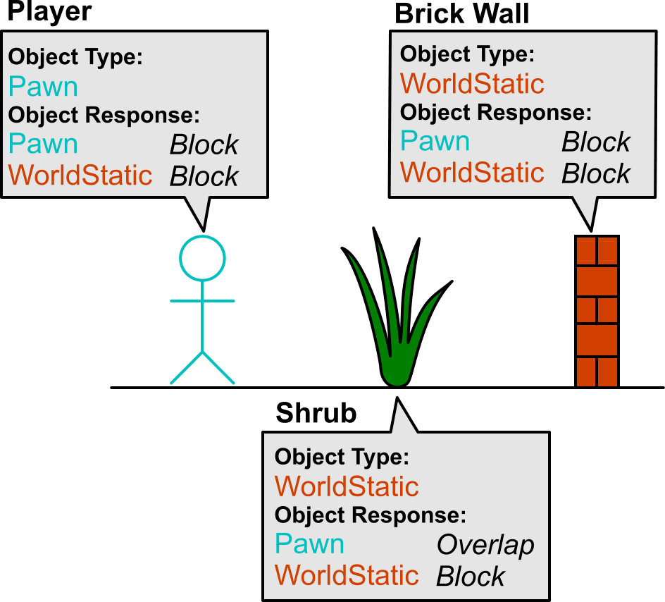
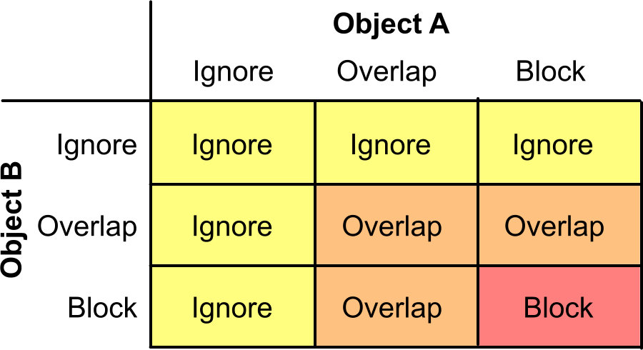
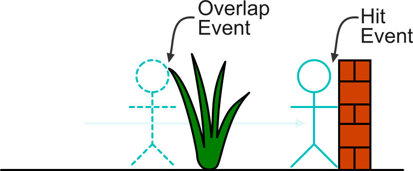
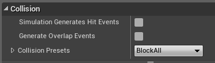
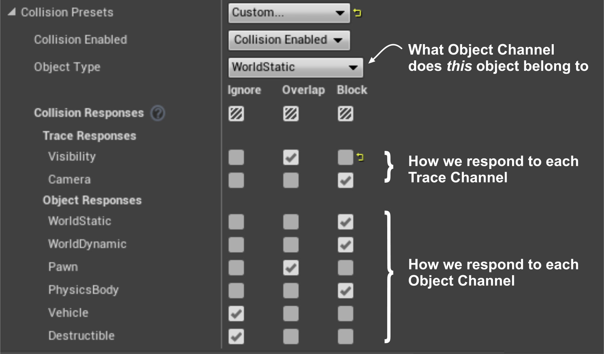
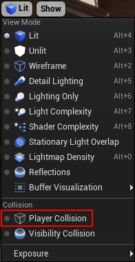
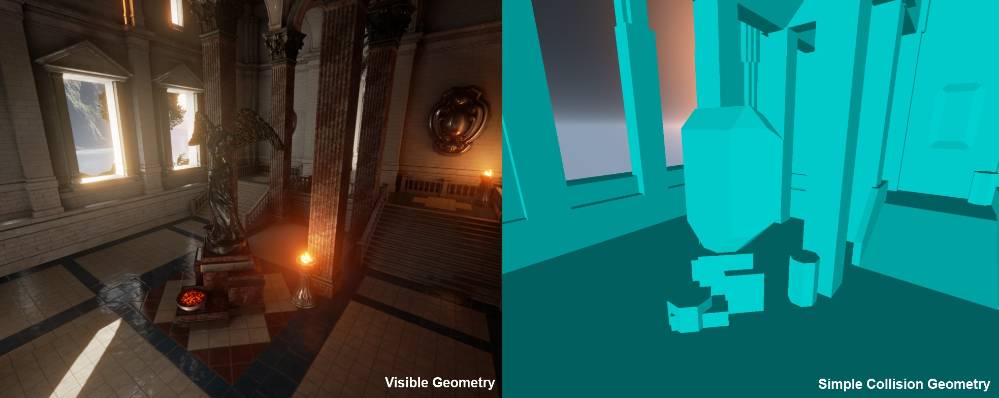

Bài này nói về chuyện collide (va chạm) trong UE, những cái responses khác nhau với collision, cách dùng channels để filter collisions, cũng như liệt ra các điểm khác nhau giữ simple và complex collision geometry.

# Blocking, Overlapping và Ignoring

Tương tự bên Unity, có 3 kiểu: blocking, overlapping và ignoring. Một wall có thể “block” player, nhưng trigger có thể “overlap” nó, và trigger có thể xuyên qua. 2 trường hợp đều tạo ra 1 event, nhưng mà khác biệt nhau: “hit” và “overlap”.

“Ignore” là bỏ qua luôn. Không có event không có gì hết.

Tức là có tổng cộng 3 kiểu responses types.

# **Trace Channels and Object Channels**

Hãy tưởng tượng ta có 1 thiết kế như này: Player thì sẽ bị wall block, còn đi xuyên cây. Vì ta set cả Shrub và Wall là WorldStatic, nên làm cách nào để Player có thể chỉ đi xuyên qua Shrub?

   
  <i>Các loại camera view cơ bản</i>

UE đã giải quyết nó bằng cách tạo ra 2 lớp đối chiếu: khi vật A collide với vật B, thì ta sẽ đồng thời tính toán:

- Vật A sẽ response với vật B như nào (Blocking, Overlapping và Ignoring)
- Vật B sẽ response với vật A như nào (Blocking, Overlapping và Ignoring)

Sau khi có 2 thông tin này, ta sẽ tổng hợp lại theo bảng sau:

   
  <i>Bảng đối chiếu response</i>

Dễ thấy Player và Shrub là Block + Overlap = Overlap, còn Player với Wall là Block + Block = Block.

Do đó, kết quả là như này:

   
  <i>Kết quả các event</i>

Nếu trong game, ta có 2 player và muốn 1 player trở nên “ghostly”, ta chỉ việc đổi cái response to Pawn channel từ Block sang Ignore mà thôi.

# **Collision Presets**

Tuy nhiên setup tay cũng mệt, UE có sẵn 1 số cái preset cho nhiều built (invi wall, physic actors,…)

   
  <i>Collision preset</i>

Nếu không muốn thì ta có thể custom

   
  <i>Collision custom set</i>

# **Simple and Complex Collision**

Ở UE, mỗi object có thể có “complex” và “simple” collision representation. Complex Collision thì refers về việc sử dụng cái rendering geometry cho collision. Cái này thì vd như weapon traces, ta muốn bắn thì trúng tường hay các vị trí mà ta nhìn thấy (cũng ko quá nhiều cases). Simple thì đơn giản hơn và nhẹ hơn.

   
  <i></i>

   
  <i>Collision view</i>

# Conclusion

Vậy là hết rùi đó. Cũng đơn giản dễ hiểu, và khá khá giống Unity nhỉ hehe.