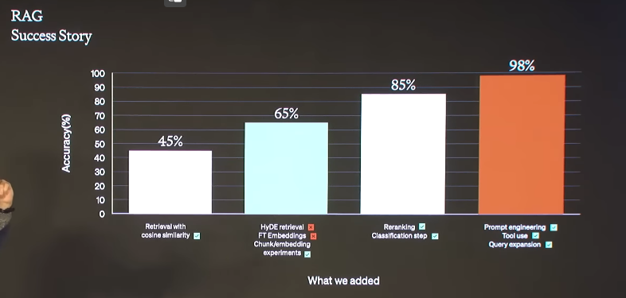
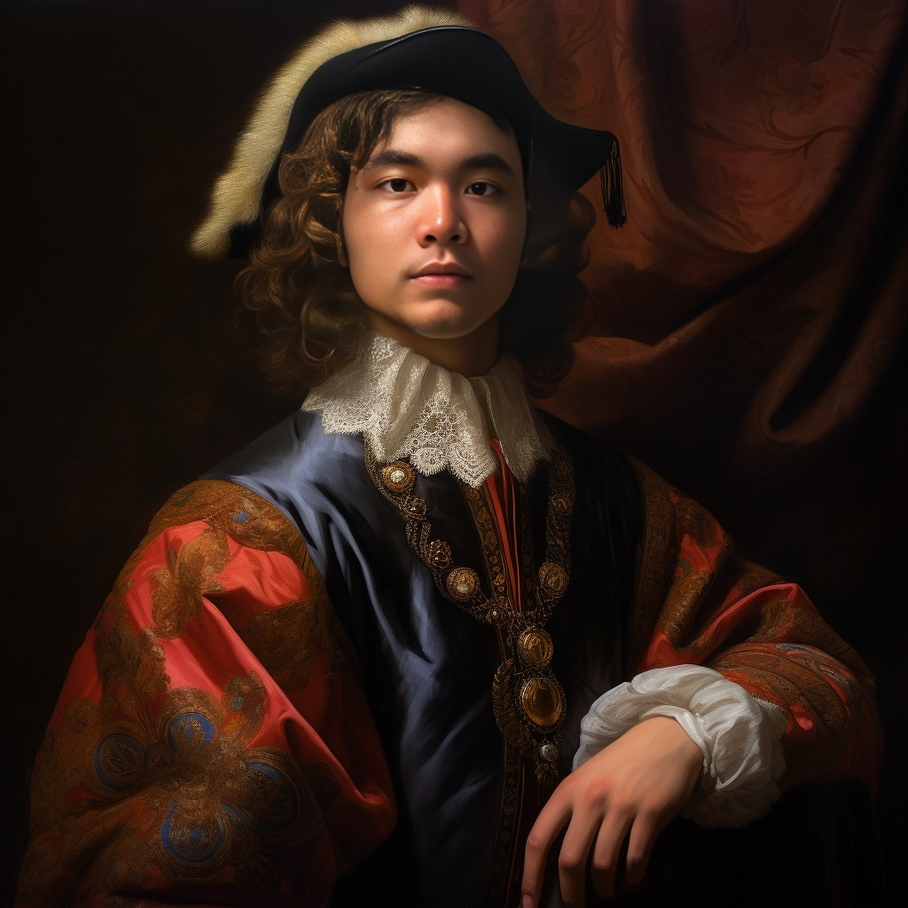

Another new year is here. 2023 was all about GenAI, from its tech buzz to the drama. I took a U-turn, diving deep into AI once again. I want to recap what I learned and made last year and share my thoughts and plans for this year. So, let's begin!

# What I Learned in 2023

## GenAI - LLMs

Being into AI, I naturally explored LLM this year. I worked on projects ranging from RAG with vector DB for user queries to using LLM for various NLP tasks. LLM has changed the NLP game.

What fascinated me the most was the concept of agents. I believe it will evolve into a unique "art," needing custom tweaks for each company, but eventually, most will adopt it.

Some areas I haven't explored much:

- LLM training: It's costly, but I think for around $10k-$50k, many companies could give it a shot.
- LLM finetuning: I've mainly used prompt engineering instead. However, for my projects, I'd consider converting these into a finetuned model.
- Agent: I've just started understanding how to tune a model into an agent. This seems promising.
- Detailed techniques: There are various techniques to enhance results, like:

   
  <i></i>

## GenAI - Images

I've dabbled a bit here. The models are impressive. However, I'm not interested in making money from controversial content.

My biggest regret in 2023 was failing to launch an AI avatar app (I got it in May, and you need ~1-5s to make this with only 1 photo)

   
  <i></i>

## Serverless GPU

In 2023, I realized that major cloud providers don't offer Serverless GPU services. I used Modal to deploy my AI avatar app. It ran okay but was slow to wake up, even when not in a cold start. Maybe I need to improve this.

I also tried Salad, but they lacked documentation and weren't user-friendly.

Dedicated GPU servers from smaller providers are much cheaper, but they require manual scaling, unlike serverless options which are easy to set up.

## FastAPI

I used this to create APIs. Nothing much to say here.

## New Coding Paradigm

VSCode with Github Copilot and GPT-plus has changed how I code. Now, I manage a pilot to code rather than doing it myself. But I still read each line because delivering quality work is what matters most.

## Building Things Principles

Any principle could be right, but you need to choose what works for you and improves your results. For me, it's about being fast and efficient.

# My current stack/flow

- **VSCode with Github Copilot:** I'm considering canceling my subscription and looking for alternatives. I do think Mixtral one is the best replacement, and I even could host it somewhere to use it (or local with Mistral 7B).
- **GPT-Plus for Coding and Research:** I haven't found anything that compares to GPT-Plus. It's even better than GPT-4 for certain tasks.
- **Gradio for Quick MVPs:** It's my go-to for creating minimum viable products.
- **Obsidian for Logs and Notes:** It's fast and easy to organize. Combined with Git, it's incredibly efficient.
- **FastAPI for Backend:** It's my choice for backend development.
- **Plotly/Dash for Visuals:** Great for creating visual components.
# What I Plan to Learn/Make in 2024

## Launch a Complete System and Company

I'm aiming to launch a product or company, likely related to LLM, but I'm open to other areas as well.

## Rust + Bevy

- **Rust:** I want to master Rust to develop quick and lightweight 2D prototypes. I'm not sure about smartphone development, but for game development, I'm interested in Bevy.
- **Bevy for Game Development:** I'm drawn to Bevy, especially as Unity isn't very appealing right now. I'll stick with Unreal Engine for 3D projects, but those are more time-consuming than I can manage at the moment.

This YouTube clip inspired me to explore Bevy: 



Hope that I could proudly write much more in the next year.