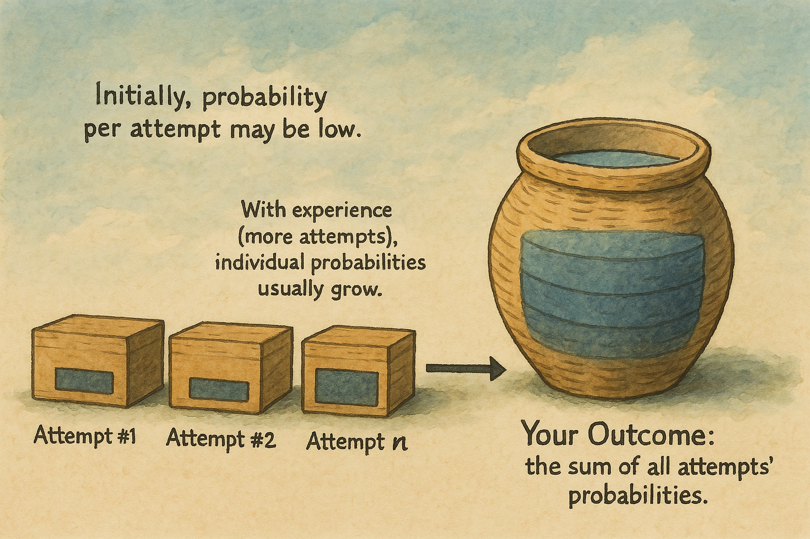

Most of us have heard that phrase countless times: "It’s a number game."

Salespeople believe it. Investors rely on it. Artists whisper it to themselves after their hundredth submission.

But what does it really mean?

Like most simple expressions, there’s deeper wisdom hiding inside.

The math behind it is straightforward:

`Outcome = P₁ + P₂ + P₃ + ... + Pₙ`

Your total outcome is simply the sum of the probability of success from each individual attempt.

Two key insights immediately appear here:

First, it's clear that a dependable way to immediately increase your total result—your sum—is to increase the number of attempts ("n"). If your success rate is around 10% per try, making 100 attempts likely yields about 10 successes. Make 1,000 attempts and you’ll likely achieve around 100 successes. Thus, scaling attempts (your quantity) is almost always a reliable way to improve outcomes, provided each attempt has at least a reasonable probability.

Second, and equally important, the probability in each attempt is not fixed. In practice, probabilities usually improve with practice and learning. Your first sales call might have a 5% chance of success, but your hundredth call might easily become 20%. This is not luck—it's human learning at work.

But here’s the critical part most people overlook: **Meanwhile, learn along the way.**

The real secret to mastering "the number game" isn’t only scaling blindly—it’s building constant improvement into every step. When you increase attempts, experience builds. And from experience, improvement flows naturally.

Imagine each attempt as a small experiment. You try, you observe carefully what happens, and you naturally learn something new. Each attempt teaches you about subtle improvements—about what works and what doesn’t.

In other words: the power of scale is massively magnified if every attempt generates new insights.

This idea of incremental improvement—gently but steadily boosting your quality—turns simple repetition into something magical. Each attempt doesn’t merely add one more probability to your outcome. Instead, it gradually lifts the quality of all future attempts, multiplying their effectiveness over time.

The math captures this clearly:

`Outcome = P(x, 1, Q₁) + P(x, 2, Q₂) + … + P(x, n, Qₙ)`

Here, the quality factor "Q" isn’t fixed. It gently increases with each new attempt, improving your overall probabilities steadily as you go.

   
  <i>Quantity could improve quality</i>

That's the profound insight hidden behind this simple phrase:

> Scale isn't just about quantity. It's about using the opportunity scale provides to learn, adapt, and improve your quality with every single attempt.

This matters tremendously in practice. Many people either chase quantity alone—making the same mistakes repeatedly—or get stuck obsessing over quality, trying to perfect each attempt without scale. Both approaches miss the real opportunity.

A far better practical strategy:

+ First, set your baseline: a minimum, acceptable quality or success probability.
+ Immediately begin increasing the total number of attempts.
Constantly learn along the way. Gently but consistently improve quality with each new attempt.
+ Watch as quality and quantity multiply your results together.
+ Over time, this gentle, adaptive learning—combined with your increased scale—creates exponential results. This isn’t theoretical; it’s how virtually every highly successful person naturally arrives at their remarkable outcomes.

This is the real wisdom tucked inside the phrase, "it's a number game."

Turns out, what seemed like pure repetition is actually perpetual improvement. What looked like a humble numbers game was secretly a beautiful learning loop all along.

Who knew?
