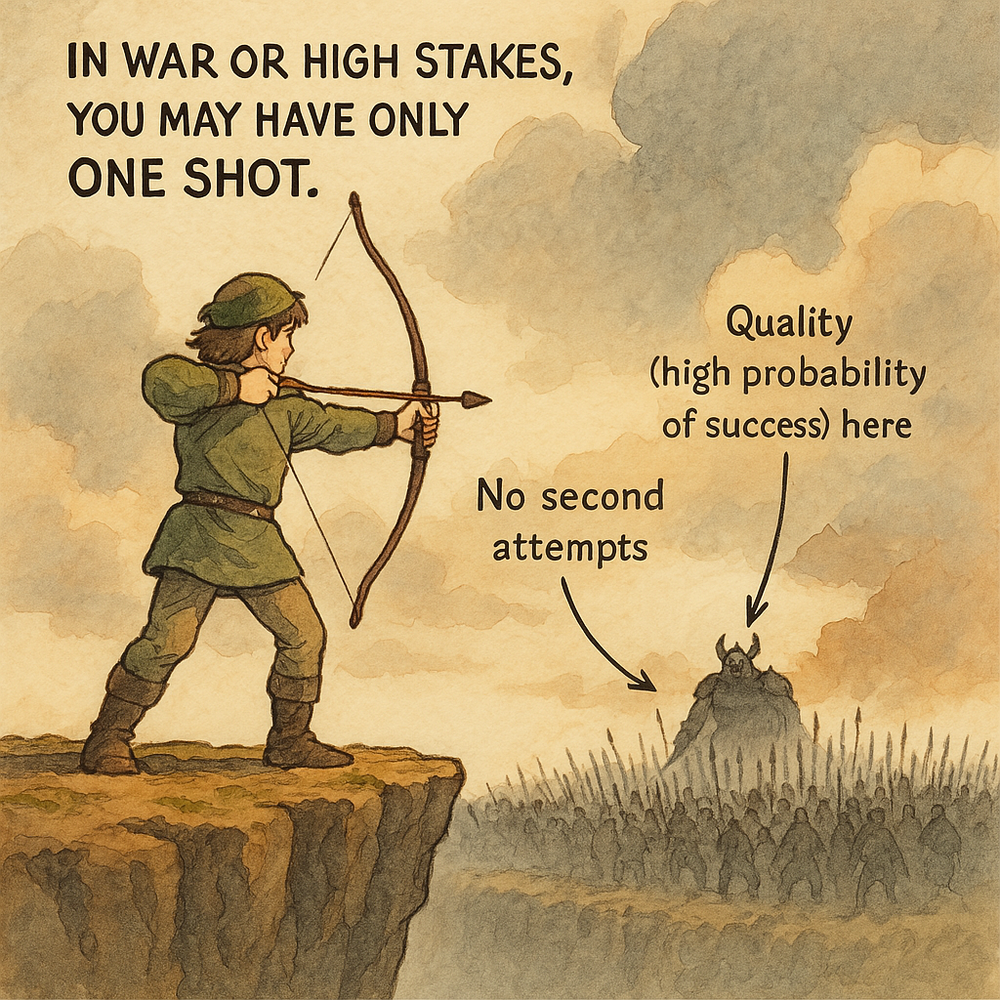

# It's a Number Game

You've probably heard the phrase countless times: "It's a number game."

Salespeople rely on it. Startup founders swear by it. Artists whisper it after their hundredth rejection. Yet many seem to miss why the idea is so fundamentally powerful.

What's the real meaning? The math behind it is surprisingly simple:

`Outcome = P₁ + P₂ + P₃ + … + Pₙ`

Your total outcome is the sum of probabilities from each individual attempt. Clearly, success is closely tied to making more attempts (n). If each attempt has a reasonable chance of success, increasing the number of tries directly increases your total success.

But beneath this simple addition lies a subtle truth that people often overlook clearly: **Your quality isn’t fixed—you usually get better with each attempt.**

Each attempt doesn’t simply offer another shot at success. It also generates insight, knowledge, and subtle but meaningful improvements. Mathematically:

`Outcome = P(x, 1, Q₁) + P(x, 2, Q₂) + … + P(x, n, Qₙ)`

Quality (Qᵢ) is rarely static. With each new attempt, you gain small insights and knowledge. As a result, Qᵢ usually rises gradually, slowly pushing your probability upward with experience.

   
  <i>Quantity could improve quality</i>

This leads directly to a practical, powerful insight:

+ First, reach a minimally acceptable quality level (good enough probability per attempt).
+ Then, rapidly increase your number of attempts (n).
+ Most importantly, learn and gently improve quality further with EACH attempt.
+ Because few people consciously combine these simple factors, applying this wisdom in real life can put you surprisingly far ahead.

# Real-life examples clearly explained

## Example 1: Momentum in Startups

Sam Altman, founder of OpenAI and former president of Y Combinator, captures this idea clearly in one sentence:

> "One of the most important jobs you have as a founder is to never lose momentum."

   
  <i>Don't lose momentum</i>

But what does Altman really mean by momentum, practically speaking? Momentum means continuing rapidly—making more attempts (increasing n) faster and learning fast enough to improve the quality (Qᵢ) of each next attempt subtly.

Why is losing momentum dangerous? Because it's easy to underestimate how quickly your chances decline if you pause and lose touch. Pauses reduce feedback, learning opportunities disappear, and quality quickly drops. Thus, momentum is not merely speed. It is speed plus the consistent improvement of each attempt.

By maintaining rapid, repeated attempts, startup founders strategically leverage both scale (quantity) and learning (quality) together.

## Example 2: Endurance and Uncertainty

Another insightful example clearly reveals the powerful interplay of quantity and quality:

> "You beat 99% of people—not by being smarter or luckier—but by enduring pain and uncertainty longer."

In practice, most people quit after a small number of tries, especially if initial probabilities feel low. They get discouraged easily and stop prematurely.

Those who instead increase their number of attempts (n) by enduring uncertainty reap two huge benefits clearly:

+ A large number of attempts itself increases the chance of eventual success.
+ But more importantly, repeated attempts build experience and insight. With experience, their quality naturally climbs. Each subsequent attempt becomes gradually more effective.

Thus, in difficult scenarios, the ability to endure increases both quantity (attempts) and quality (learning from attempts).

# Important nuance and context

Of course, the "numbers game" principle clearly depends on your context. Not all scenarios allow multiple attempts easily.

+ For instance, war often only gives one opportunity: you either win decisively or lose everything. In this scenario, quantity (number of attempts) matters far less. Instead, quality—making sure your probability is extremely high—is absolutely critical.
+ But in business, startups, careers, selling, publishing, investing, the scenario is exactly opposite. You usually receive many attempts. Optimizing quantity and maintaining gentle improvement in quality is clearly and powerfully beneficial.

   
  <i>Sometimes, we only have 1 shot</i>

The power of the idea clearly depends on your situation. Identify that clearly first, then apply the "numbers game" principle strategically.

# Putting the Numbers Game to Work (clear, concise, practical action):

To harness the practical strength of the "numbers game" idea:

+ First establish a "good-enough" quality threshold. Simply improve until you're just above acceptable probability.
+ Immediately after, scale aggressively by multiplying your attempts. ("Never lose momentum.")
+ Each attempt, consciously observe and learn. Always gently raise quality further using your new insights.
+ Be patient. Your growing experience gradually improves your effectiveness.

That's all clearly there is to it: Set a baseline quality. Maintain high scale and momentum. Learn continually along the way.

This is what people really mean by "it’s a number game." Beneath the surface of simple repetition is a beautiful, subtle, deeply practical learning loop.

Easy to say. Powerful to apply. Surprisingly deep beneath the simplicity.
