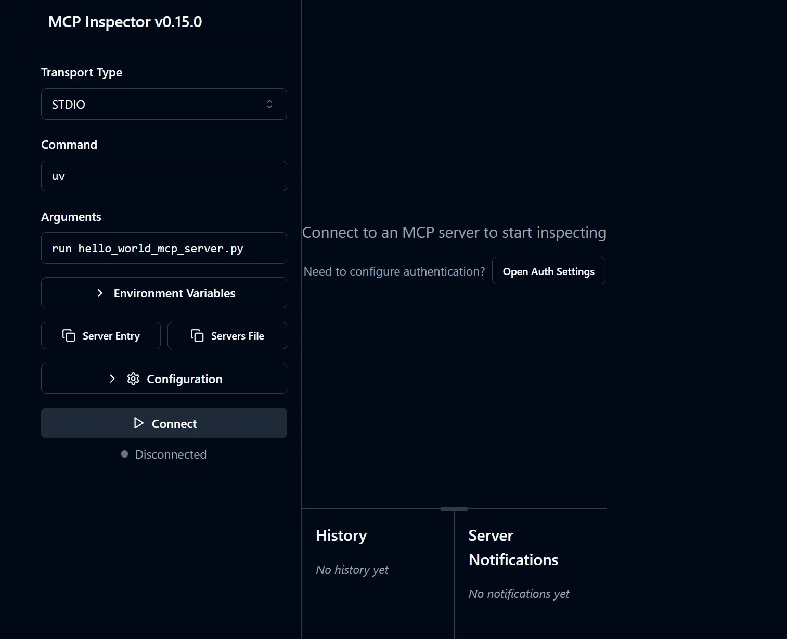
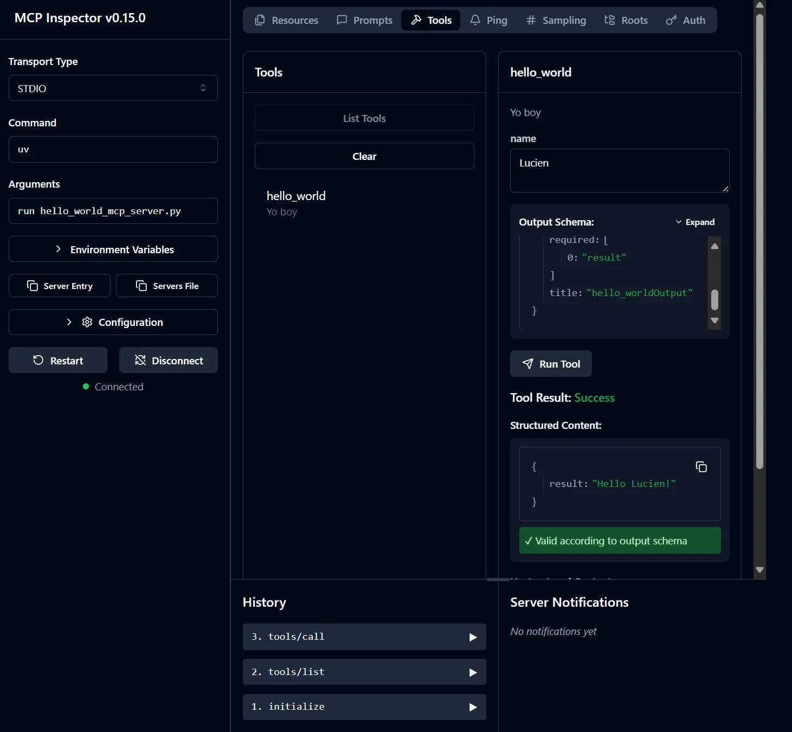

Có 1 điều mình hơi bất ngờ là những ví dụ về hello world của MCP đều rất dài, thậm chí có phần phức tạp?

# Quick intro

The Model Context Protocol allows applications to provide context for LLMs in a standardized way, separating the concerns of providing context from the actual LLM interaction.

MCP là 1 chuẩn kết nối (protocol) nhằm chuẩn hóa, để các LLM có thể nhanh chóng kết nối với các công cụ khác theo chuẩn chung này. Những công cụ kết nối được tổ chức dưới dạng server và có các tools, phản hồi khi nhận được request (không nhất thiết từ LLM). Các server cung cấp thêm thông tin đi kèm giúp các LLM có thể sử dụng các tool 1 cách hiệu quả.

# Python MCP - Hello world

Do MCP vốn là 1 chuẩn, nên cách tốt nhất và thường dùng, là dùng python-sdk, đây là bản official từ  `modelcontextprotocol` github, giúp cho việc thực hiện MCP dễ dàng hơn. Tất nhiên, ta hoàn toàn có thể code toàn bộ từ đầu tới cuối không quá khó khăn, tuy nhiên sẽ mất công hơn nhiều.

Trong bài viết này, mình thực hiện qua WSL trên window, nghĩa là không khác ở các môi trường Linux, và có lẽ là với macOS cũng không có khác biệt nhiều. Đầu tiên, chúng ta nên thực hiện cài đặt qua `uv`. Cách thực hiện khá đơn giản, chỉ cần vào folder và chạy các lệnh sau:

```markdown
uv init
uv sync
uv add mcp[cli]
```

Tức là ở đây, ta chỉ cần cài package `mcp[cli]` là đủ.

Về code, cũng rất đơn giản, ta chỉ cần:

- khai báo MCP server
- khai báo tool (bằng việc sử dụng decoration `@mcp.tool`)
- tiến hành chạy MCP server ở main

Cụ thể code như dưới đây

```python
from mcp.server.fastmcp import FastMCP

mcp = FastMCP("hello")

@mcp.tool()
def hello_world(name: str) -> str:
    """
Yo
    boy    
    """
    if name == "":
        name = "world"
    return f"Hello {name}!"

if __name__ == "__main__":
    mcp.run(transport="stdio")
```

Chú ý, ở phần `"""Function description"""` , ta có thể viết bất kỳ thứ gì, thậm chí bỏ qua. Tốt hơn hết nếu bạn viết 1 description theo chuẩn, gồm nội dung function, những điểm cần chú ý, nội dung các input và output. Tuy vậy, ở đây mình viết 1 function description vô nghĩa, nhằm mục tiêu cho thấy MCP có thể hoạt động với bất kỳ function description nào (tất nhiên sẽ kém hiệu quả và ít thông tin hơn).

Ngoài ra, ở dòng cuối, `mcp.run(transport="stdio")` nghĩa là MCP giao tiếp qua luồng nhập/xuất chuẩn (STDIO) - tức chạy cục bộ trong cùng môi trường (1 ví dụ đơn giản là việc chương trình đọc–ghi trực tiếp các dòng `print` trong terminal). Khi triển khai thực tế, ta thường dùng các dạng **remote transport** khác (ví dụ streamable HTTP hoặc SSE) để kết nối qua mạng.

# Chạy và check thử MCP

Để chạy MCP, đơn giản ta chỉ cần chạy:

```
$ npx @modelcontextprotocol/inspector uv run hello_world_mcp_server.py 
```

Khi đó, sẽ hiện ra thông báo như dưới đây.

```
Starting MCP inspector...
⚙️ Proxy server listening on 127.0.0.1:6277
🔑 Session token: ef04190ba429014939e6dbcdfe26e8246e2c38a2d1cbe4168b6c7036b8a20d97
Use this token to authenticate requests or set DANGEROUSLY_OMIT_AUTH=true to disable auth

🔗 Open inspector with token pre-filled:
   http://localhost:6274/?MCP_PROXY_AUTH_TOKEN=ef04190ba429014939e6dbcdfe26e8246e2c38a2d1cbe4168b6c7036b8a20d97

🔍 MCP Inspector is up and running at http://127.0.0.1:6274 🚀
```

Bạn chỉ cần truy cập vào link `http://localhost:6274/?MCP_PROXY_AUTH_TOKEN=....`, sẽ xuất hiện 1 trang web như sau. Bạn chỉ việc connect và nghịch thử các setting, các function

<div align="center">
  <br>
  <i>Giao diện inspector cho MCP.</i>
</div>


Ví dụ như dưới đây, ta dùng thử tool `hello_world` của MCP server

<div align="center">
  <br>
  <i>Khi ta đã connect với MCP server và dùng thử tool.</i>
</div>


# Kết thúc

Ok, mình nghĩ thế là đủ dài cho 1 bài viết hello world rồi. Trong những bài viết tiếp theo, mình sẽ đi vào cụ thể hơn các thành phần của MCP, cách kết nối với các LLM application, thậm chí là cách viết các LLM application để dùng MCP, và cách improve hiệu quả của MCP.

Cheer!