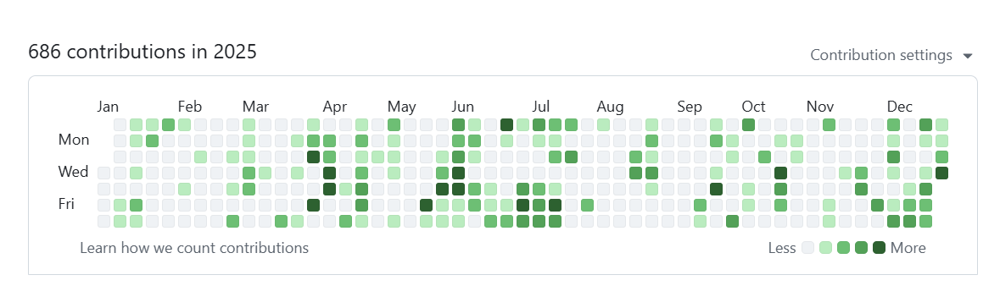
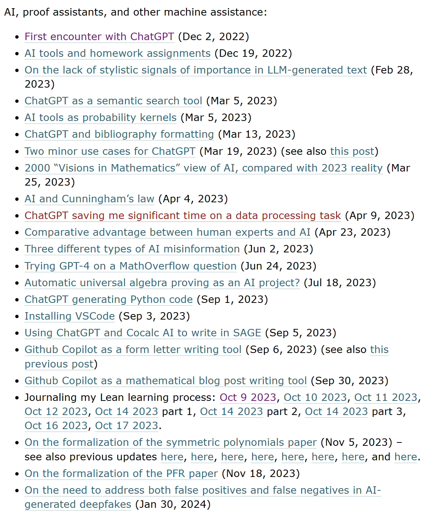

2025 là 1 năm mình không có thành quả gì. Nhưng nó không hoàn toàn là thất bại như 2024, vì khác với 2024, mình đã làm rất nhiều thứ (nhưng đều fail). Chỉ có thể nói là mình quá kém, còn mình không đồng ý rằng mình chưa cố gắng, dù sự cố gắng ấy vẫn chưa phải là hết sức mình. 2026 mình sẽ nỗ lực hơn nữa.

Mình sẽ viết nhiều hơn bằng tiếng Việt, ngôn ngữ mình (đương nhiên) là quen thuộc và rành rẽ hơn. Maybe i will try to produce some pieces in English, but whatever.

Format bài này hơi khác mọi năm.

# Chưa đủ, chưa đủ

Mình viết quá ít. Làm quá ít. Nghĩ quá ít (hoặc nghĩ nhiều mà ra thành phẩm ít).

2025 mình có 686 commits. Những năm trước đó, 2024 2023 2022 2019 là nhiều nhất, nhưng cũng chỉ ~200 commits/year là cùng. Xấu hổ. Kể cả 700 commits cũng là quá ít.

   
  <i>Fix lỗi ở comic. First shot.</i>

Hôm rồi thấy Terrence Tao viết về AI chắc phải x4 x5 lần mình, dù mình chỉ biết về AI. Tự thấy xấu hổ, mình cần viết nhiều hơn, vì những thứ ấy cũng quan tọng mà. Có thể bỏ bớt về form, chú ý về content, đặc biệt Ai tool hiện nay improve tool cũng tốt mà.

   
  <i>Fix lỗi ở comic. First shot.</i>

Faster, faster sẽ là câu chủ đạo để nhắc mình, quá nhiều thứ cần làm trong khi tài nguyên hạn chế (và thời gian luôn luôn là hạn chế).

Draw Antonio, draw Antonio, draw and dont waste time - Michelangelo.

# Những gì mình làm (được hoặc không)

## Lần đầu launch web và publish

Mình đã lần đầu publish 1 web, và có rất nhiều trải nghiệm với nó.
Web của mình là 1 thứ khá phức tạp: 1 môi trường có các nhân vật có thể di chuyển, có obstacles (tức là path finding luôn), nhiều nhân vật, mỗi nhân vật có context và setting riêng biệt (cũng đơn giản mà khá lằng nhằng), tất nhiên kết nối LLM. Có trigger action các nhân vật với zone, hệ thống visual novel với character emotion riêng, mình thấy top notch cmnl.

Mình có làm youtube shorts để quảng bá, không ngon lắm. Mình vẫn nghĩ là nó ok thôi, nhưng thôi cũng ko push tiếp làm gì.

https://www.youtube.com/watch?v=frvSaT5cFrg

Vẫn là 1 piece mình thấy rất tuyệt. Nhưng nói chung, đó là 1 thời điểm mình quá stress, đã âm tiền nặng và rất lâu chưa đi làm để có tiền, lại còn hỏng 2 vụ tiền nong (đặc biệt vụ với ig0t@I, thật sự mình thấy rất khó chịu). Mình nghĩ nếu bây giờ push lại, nó sẽ ngon lành. Đó thật sự nên là 1 project để làm khi không quá bận.

Nhưng nhờ đó, mình biết về web, lần đầu host lên domain nghiêm chỉnh, CI/CD, thậm chí là làm shorts (dù chỉ vài short thôi). Làm cũm nhanh, chỉ có 1-2 tuần đã ra được như thế. Mình thấy ổn.

## Rất nhiều PoC và những thứ chưa thành hình

Mình nhận thấy trừ 1 số sản phẩm thực sự khó và nổi bật về công nghệ, thì mình có thể làm hàng loạt những thứ khác. Rất nhiều PoC và các thứ.

Và mình stuck ở marketing. Chừng nào chưa giải quyết được nó, chừng đó mình còn không thể làm được gì. Trừ khi mình có 1 sản phẩm deep tech và bản thân lấy technical làm điểm bật (rõ ràng là mình không có, và với nguồn lực hiện tại mình không lựa chọn con đường này).

## Đáng tiếc

Mình quá bay và không làm sản phẩm cho trend vibe code. Quá tệ.

# What I Learned in 2024

## GenAI - LLMs

Vẫn là 1 mảng ghép chính với mình. Mình đã đào sâu hơn vào tầng ứng dụng của LLMs. Build agent, đào về MCP (cả MCP server và bây giờ đang build MCP client), làm chatGPT apps, làm LLMs on device, ý đồ làm game LLM (legit, nhưng sau đó mình chuyển sang 1 game khác mình cho là phù hợp bản thân + maybe kiếm tiền tốt hơn). Khả năng nếu năm nay có tiền, thì đẩy nguồn lực qua làm AI town. Mà đó là chuyện của 2026.

Btw đầu năm ngoái mình đã rất sai lầm khi không đánh giá đúng o1.

## AI dev tool

Mình sử dụng CC (nhưng sau rất nhiều benchmark tự làm, mình thấy Codex ổn hơn, và rẻ hơn, nhanh hơn). Mình rất không hiểu những người shill CC như vậy, họ làm được gì đáng kể? Đọc post của Zvi nói về CC, mình hiểu nó có 1 cái rất tiện ở tầng personal (nhưng lại cũng chỉ là optimize the non-significant), chứ hỏi hàng trăm kol mõm nhôm đi shill, làm được gì, chỉ toàn những thứ non significant mà dùng AI devtool nào cũng làm được, chả có gì đáng nói.

## Tech stack

React rõ ràng là framework front end LLM sử dụng tốt nhất. Mình stick với Vite để build, cũng không quan trọng.
Những gì web làm được, mình sẽ dùng web stack. Tất nhiên, vẫn có 1 số game sẽ dùng Unity (đặc biệt là 3d), nhưng nói chung ưu tiên web stack.

## AI using Paradigm

Mình thấy cách tối ưu để dùng AI là hỏi 2/3 AI 1 lúc. Chúng sẽ trả lời rất khác nhau, và ta do đó sense được cái giọng trả lời của các AI, các đặc điểm của chúng. Có 1 số con model như GPT 5.2 vừa asshole vừa cứng đầu, trình độ tạm tạm, nhưng ko thể làm task khó vì nó ko có khả năng điều chỉnh (vì task khó thì thường cần điều chỉnh chứ 1 shot thì khó mà ăn). Mình thường dùng Gemini (vì free), GPT 5.1 (nó có độ push back ở mức độ rất tuyệt), Sonnet 4.5 (vì free, nói chung Opus mình có thử dùng 1 tháng và rất thiếu ấn tượng).

Coding đã chuyển qua terminal, dùng CC vài tháng trước khi dùng Codex. Mọi người hay khen opus nhưng mình chỉ thấy nó là 1 model code tốt chứ không thông minh lắm, có thể vì những người KoL mõm nhôm shill thì làm project cũng đơn giản (và đơn giản thật).

## Marketing

Đã có 1 số hiểu biết đầu tiên. Giờ thì mình chọn steam với framework của anh trai Chris.

## Other things

Mình muốn học toán, nhưng không biết có xếp được thời gian? Và còn muốn học lại thuật toán bài bản chút. Liệu có ok?

# My current stack/flow

+ ChatGPT + AI studio for chat and research
+ VS code + Codex for coding: VScode still great, Codex is fast, smarter, and much cheaper than CC. Also, i did some tests on making features on my project, CC is never better than codex.
+ FastAPI + React for the win: những thứ LLM thông thạo nhất. Vd hỏi Flutter là bí xị ngay. Hoặc như chatgpt không có khả năng gen mermaid chẳng hạn. Nói chung phải biết giới hạn chúng nó để dùng cho tốt.
+ Notion: back to notion. Obssidian sau nhiều năm vẫn không làm 1 feature đơn giản mà được request nhiều là collapse block/hide block. 

# What I Plan to Learn/Make in 2026

+ Launch 2 games on steam: 10k and biab.
+ maybe i will learn math? What math? Maybe algebra and calculus, maybe more.
+ maybe have enough resource for AI town?
+ I really want to make some chatGPT apps, but not enough time now. Faster, faster.