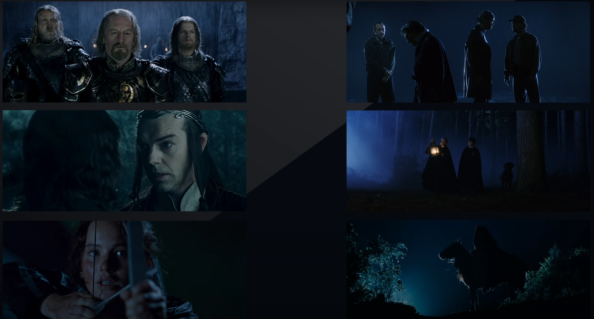

Không nhiều như các cảnh ban ngày, nhưng các cảnh ban đêm cũng rất thường xuyên xuất hiện trong phim ảnh và game. Để tạo ra các cảnh ban đêm không chỉ đơn giản là ta hạ thấp độ sáng của scene xuống, mà ta còn cần nhiều kỹ thuật khác. Vậy, bài viết này sẽ đi vào việc tạo ra 1 night scene đơn giản trong UE5.

# Film breakdown

   
  <i></i>

Nếu xem các cảnh film ban đêm, thì sẽ thấy:

- các cảnh đêm ám màu blue
- Ánh sáng cũng không phải chuẩn 1 nguồn sáng như moon light, ta sẽ đặt các ánh sáng thêm vào nữa để làm rõ được đối tượng mà ta muốn.

   
  <i></i>

   
  <i></i>

Lý do cho việc này là moonlight quá yếu. Nếu ánh sáng mặt trời là 100k lux thì moon light là 0.5-1 lux. Thêm nữa, thực ra moon light có màu ám đỏ vì nhiệt năng thấp hơn, có điều nếu để màu chính xác thì lại không tạo ra không khí ban đêm.

Cách người ta làm là quay vào ban ngày và điều chỉnh ánh sáng cho có vẻ là ban đêm. Ở đây, chủ yếu là điều chỉnh high light, exposure và white balance.

   
  <i></i>

   
  <i></i>

# Thực hiện ở UE5

## Sky creation

Đầu tiên, ta có thể xóa các light đi, để thành 1 scene không có ánh sáng.

Thêm BP_Sky_Sphere vào. Chú ý bật Show Engine content mới có thể lựa chọn được, bởi đây là 1 engine content.

   
  <i></i>

   
  <i></i>

Khi điều chỉnh Sun Height, ta sẽ có 1 bầu trời vào ban ngày/hoàng hôn/ban đêm. Ta có thể chỉnh Stars brightness nữa. Ở đây, stars thật ra là các đốm sáng trên nền 1 texutre. Nếu như muốn các sao có vị trí khác, thay đổi số lượng sao, ta thay đổi texture cho cái BP_sky_sphere này là được.

## Directional Light (Moon)

   
  <i></i>

Thêm Directional light và bỏ vào (tạm xóa post processing đi) thì ta được thế này. Tới đây, ta vẫn chưa thấy ra dáng 1 night scene lắm. Ta cần điều chỉnh cường độ sáng và các thứ khác nữa.

Ta nên căn chỉnh silhouette vì đó là thứ rất quan trọng trong việc tạo hình dáng cho night scene, và giúp cho bối cảnh trông có vẻ nghệ thuật hơn.

## Volumetric Fog

Thêm Volumetric Fog vào.

Chọn Volumetric Fog. Trước đó nhớ chỉnh các color về black, vì Volumetric fog là additive.

   
  <i></i>

Chỉnh Volumetric Scattering Intensity lên 3, để cho hiệu ứng ánh sáng dày hơn. Kiểu ánh sáng qua cảnh vật nó mạnh hơn.

   
  <i></i>

## Skylight

Ta cần skylight để ánh sáng bounce đều hơn, các vùng shadow sáng hơn

   
  <i>Trước khi có skylight bounce</i>

   
  <i>Sau khi có skylight bounce, chú ý phần nóc nhà</i>

Đây là hình ảnh khi tắt/bật. Ta điều chỉnh 3 thông số:

- sky distance threshold: về 1
- turn off lower hemis.....
- điều chỉnh intensity theo ý muốn.

Sau đó ta điều chỉnh màu và intensity của Directional light

   
  <i></i>

## Practicle light

Ta có thể thêm 1 số light để trông cho đẹp hơn, các field light thôi.

Ngoài ra chỉnh post process để ánh sáng cố định hơn.

Điều chỉnh 1 số thông số ta sẽ có cảnh như này. Cảnh đêm này trông vẫn rất đơn giản sơ sài, cũng không đẹp, nhưng nhìn chung đủ để ta thấy đây là 1 đêm trăng sáng. Ta hoàn toàn có thể điều chỉnh ánh snasg tối hơn, để cho cảm giác đêm tối rõ ràng hơn. Tuy vậy đây cũng tương đối đủ để là 1 bắt đầu rồi.

   
  <i></i>

# Tham khảo

[https://www.youtube.com/watch?v=1LfiYtKDsac](https://www.youtube.com/watch?v=1LfiYtKDsac&t=3s)